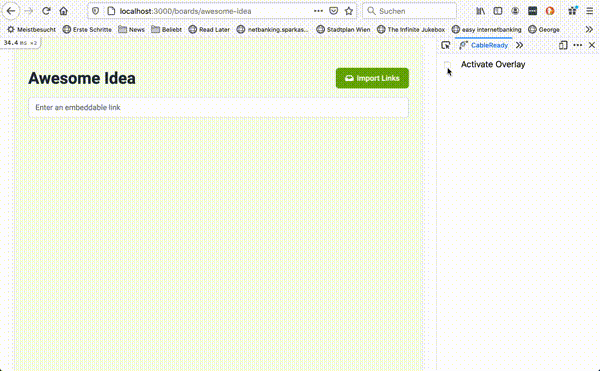

# CableReady Browser Extension

## Introduction

This browser extension includes developer tools to be used in combination with [CableReady](https://cableready.stimulusreflex.com) and [StimulusReflex](https://docs.stimulusreflex.com).

## Usage

This very first alpha version allows you to activate a useful overlay to observe changes CableReady and/or StimulusReflex  make to your DOM:



## Development

To transpile the source code using webpack, run

```sh
$ npm run watch
```

### License
MIT


